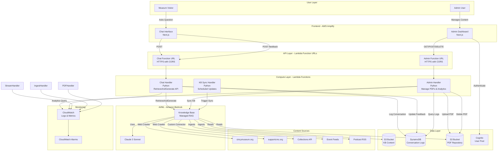

# CincyMuse Chatbot - Design Document

## Overview

CincyMuse is a bilingual conversational AI chatbot that serves Cincinnati Museum Center visitors, donors, staff, and volunteers. The system provides accurate, cited responses to questions about exhibits, collections, events, tickets, memberships, and support opportunities.

### Design Philosophy

This design prioritizes simplicity, maintainability, and cost-effectiveness while meeting all functional requirements:

- **Serverless-first**: Leverage AWS managed services to minimize operational overhead
- **Managed RAG**: Use Bedrock Knowledge Bases for automatic content ingestion, chunking, embedding, and retrieval
- **Simple architecture**: Straightforward data flow with minimal custom code (70% reduction vs manual RAG)
- **Easy deployment**: Single CDK stack deployment with minimal configuration
- **Cost-optimized**: Pay-per-query pricing with automatic scaling ($430/month vs $1,135/month)

### Key Features

- Bilingual support (English/Spanish) with multilingual embeddings
- Streaming responses with built-in source citations from Bedrock KB
- Managed content ingestion via Bedrock KB (web crawling, S3 documents, API connectors)
- One-API-call RAG using Bedrock RetrieveAndGenerate
- Admin dashboard with DynamoDB queries and CloudWatch Logs Insights analytics
- Conversation logging with PII redaction and feedback collection
- Automatic content sync via EventBridge scheduled rules

### Technology Stack

- **Frontend**: Next.js 15+ with TypeScript, Tailwind CSS, deployed on AWS Amplify
- **Backend**: AWS Lambda (Python 3.13+) for API logic
- **Infrastructure**: AWS CDK (TypeScript) for infrastructure as code
- **AI/ML**: Amazon Bedrock Knowledge Bases for managed RAG with Claude 3 Sonnet
- **Vector Store**: Bedrock Knowledge Base (managed vector storage)
- **Storage**: DynamoDB for conversation logs, S3 for PDF repository and KB content
- **Analytics**: CloudWatch Logs Insights for dashboard analytics and FAQ analysis
- **Authentication**: Amazon Cognito for admin dashboard access
- **API**: Lambda Function URLs (no API Gateway needed - simpler architecture)


## Architecture

### System Architecture Diagram



### Data Flow

#### User Query Flow
1. User submits question via Chat Interface
2. Lambda Function URL routes to Chat Handler Lambda
3. Chat Handler calls Bedrock RetrieveAndGenerate API with Knowledge Base ID
4. Bedrock KB performs hybrid search (vector + keyword) and retrieves top 5 chunks
5. Bedrock KB constructs prompt with retrieved context
6. Bedrock KB invokes Claude 3 Sonnet with streaming enabled
7. Response tokens stream back through Lambda Function URL to frontend
8. Chat Handler logs conversation to DynamoDB with metadata
9. User provides optional feedback (thumbs up/down)

#### Content Ingestion Flow
1. EventBridge scheduled rule triggers KB Sync Handler Lambda
2. Sync Handler calls StartIngestionJob API for each data source
3. Bedrock KB web crawler fetches content from cincymuseum.org and supportcmc.org
4. Bedrock KB reads PDFs and documents from S3 buckets
5. Bedrock KB custom connector queries Collections API
6. Bedrock KB automatically chunks, embeds, and indexes all content
7. Errors logged to CloudWatch with retry logic

#### PDF Management Flow
1. Admin uploads PDF via Admin Dashboard
2. PDF stored in S3 bucket with metadata
3. Admin Handler triggers KB sync via StartIngestionJob API
4. Bedrock KB automatically extracts text, chunks, embeds, and indexes
5. Admin can delete PDF, triggering S3 deletion and KB re-sync
6. KB automatically removes deleted content from index


## Components and Interfaces

### Frontend Components

#### Chat Interface (Next.js)
**Purpose**: User-facing conversational UI for asking questions and viewing responses

**Key Components**:
- `ChatContainer`: Main layout component with language selector
- `MessageList`: Displays conversation history with streaming support
- `MessageInput`: Text input with submit button
- `StreamingMessage`: Renders progressive response display
- `FeedbackButtons`: Thumbs up/down rating interface
- `SourceCitation`: Displays linked sources for each response
- `LanguageSelector`: Toggle between English/Spanish

**State Management**:
- React Context for language preference
- Local state for conversation history
- WebSocket/SSE connection for streaming responses

**API Integration**:
```typescript
// Chat API client
interface ChatRequest {
  message: string;
  language: 'en' | 'es';
  conversationId?: string;
}

interface ChatResponse {
  response: string;
  sources: Source[];
  confidence: number;
  conversationId: string;
}

interface Source {
  title: string;
  url: string;
  type: 'website' | 'collection' | 'event' | 'podcast' | 'pdf';
}

async function sendMessage(request: ChatRequest): Promise<ReadableStream<ChatResponse>>
async function submitFeedback(conversationId: string, rating: 'positive' | 'negative'): Promise<void>
```

#### Admin Dashboard (Next.js)
**Purpose**: Secure interface for content management, monitoring, and analytics

**Key Components**:
- `LoginPage`: Cognito authentication flow
- `ConversationLogs`: Searchable table of conversation history
- `PDFManager`: Upload/delete interface for customer service documents
- `FAQAnalytics`: Top 20 frequently asked questions with metrics
- `SystemHealth`: Real-time metrics dashboard (response time, error rate)
- `FeedbackReview`: List of responses with negative feedback

**Authentication**:
- AWS Amplify Auth integration with Cognito
- Role-based access control (Admin/Viewer)
- 30-minute session timeout

**API Integration**:
```typescript
interface ConversationLog {
  id: string;
  timestamp: string;
  question: string;
  response: string;
  language: 'en' | 'es';
  confidence: number;
  sources: Source[];
  feedback?: 'positive' | 'negative';
}

interface PDFDocument {
  id: string;
  filename: string;
  uploadDate: string;
  fileSize: number;
  status: 'processing' | 'indexed' | 'error';
}

interface FAQItem {
  question: string;
  count: number;
  avgConfidence: number;
  category: string;
}

async function getConversations(filters: ConversationFilters): Promise<ConversationLog[]>
async function uploadPDF(file: File): Promise<PDFDocument>
async function deletePDF(id: string): Promise<void>
async function getFAQs(): Promise<FAQItem[]>
async function getSystemMetrics(): Promise<SystemMetrics>
```


### Backend Components

#### Chat Handler Lambda
**Purpose**: Process user questions and coordinate response generation

**Function Signature**:
```python
def lambda_handler(event: dict, context: LambdaContext) -> dict:
    """
    Handle chat requests and feedback submissions
    
    Args:
        event: API Gateway event with body containing message and language
        context: Lambda execution context
        
    Returns:
        API Gateway response with streaming response or feedback confirmation
    """
```

**Pseudocode**:
```python
def handle_chat_request(message: str, language: str, conversation_id: str = None):
    # Validate input
    if not message or len(message.strip()) == 0:
        return error_response(400, "Message cannot be empty")
    
    # Generate conversation ID if new conversation
    if not conversation_id:
        conversation_id = generate_uuid()
    
    # Translate message to English if Spanish (for embedding)
    query_text = translate_to_english(message) if language == 'es' else message
    
    # Generate query embedding
    query_embedding = bedrock_client.invoke_titan_embeddings(query_text)
    
    # Search vector store
    search_results = opensearch_client.knn_search(
        index='cincymuse-content',
        vector=query_embedding,
        k=5,
        filters={'language': language}
    )
    
    # Extract context from search results
    context_chunks = [result['_source']['text'] for result in search_results]
    sources = extract_sources(search_results)
    
    # Calculate confidence score based on search relevance
    confidence = calculate_confidence(search_results)
    
    # Check confidence threshold
    if confidence < 0.7:
        response_text = get_low_confidence_fallback(language)
        log_conversation(conversation_id, message, response_text, confidence, [], language)
        return {
            'conversationId': conversation_id,
            'response': response_text,
            'sources': [],
            'confidence': confidence
        }
    
    # Construct prompt with context
    prompt = build_rag_prompt(message, context_chunks, language)
    
    # Stream response from Bedrock
    stream = bedrock_client.invoke_claude_streaming(
        prompt=prompt,
        max_tokens=1000,
        temperature=0.7
    )
    
    # Collect full response for logging
    full_response = ""
    for chunk in stream:
        full_response += chunk
        yield chunk
    
    # Log conversation
    log_conversation(conversation_id, message, full_response, confidence, sources, language)

def handle_feedback(conversation_id: str, rating: str):
    # Update conversation log with feedback
    dynamodb_client.update_item(
        table='ConversationLogs',
        key={'conversationId': conversation_id},
        update_expression='SET feedback = :rating',
        expression_values={':rating': rating}
    )
    return {'status': 'success'}
```

**Dependencies**:
- boto3 (AWS SDK)
- opensearch-py (OpenSearch client)
- Custom modules: bedrock_utils, prompt_builder, pii_redactor


#### Ingestion Orchestrator Lambda
**Purpose**: Fetch, process, and index content from multiple sources

**Function Signature**:
```python
def lambda_handler(event: dict, context: LambdaContext) -> dict:
    """
    Orchestrate content ingestion from all sources
    
    Triggered by EventBridge scheduled rules:
    - Every 6 hours for event feeds
    - Every 24 hours for websites, collections, podcasts
    
    Args:
        event: EventBridge event with source type
        context: Lambda execution context
        
    Returns:
        Summary of ingestion results
    """
```

**Pseudocode**:
```python
def lambda_handler(event, context):
    source_type = event.get('source', 'all')
    results = {}
    
    try:
        if source_type in ['all', 'websites']:
            results['websites'] = ingest_websites()
        
        if source_type in ['all', 'collections']:
            results['collections'] = ingest_collections()
        
        if source_type in ['all', 'events'] or source_type == 'events':
            results['events'] = ingest_events()
        
        if source_type in ['all', 'podcasts']:
            results['podcasts'] = ingest_podcasts()
        
        return {
            'statusCode': 200,
            'body': json.dumps(results)
        }
    except Exception as e:
        logger.error(f"Ingestion failed: {str(e)}", exc_info=True)
        raise

def ingest_websites():
    """Ingest content from cincymuseum.org and supportcmc.org"""
    websites = [
        'https://www.cincymuseum.org',
        'https://www.supportcmc.org'
    ]
    
    results = {'success': 0, 'failed': 0}
    
    for base_url in websites:
        try:
            # Crawl website with depth limit
            pages = crawl_website(base_url, max_depth=3, max_pages=500)
            
            for page in pages:
                # Parse HTML and extract content
                content = parse_html(page['html'])
                
                # Skip if content is empty or too short
                if not content or len(content) < 100:
                    continue
                
                # Chunk content
                chunks = chunk_text(content, chunk_size=800, overlap=100)
                
                # Process each chunk
                for i, chunk in enumerate(chunks):
                    # Generate embeddings for both languages
                    embedding_en = generate_embedding(chunk)
                    
                    # Translate to Spanish
                    chunk_es = translate_to_spanish(chunk)
                    embedding_es = generate_embedding(chunk_es)
                    
                    # Index both versions
                    index_content(
                        text=chunk,
                        embedding=embedding_en,
                        metadata={
                            'source_url': page['url'],
                            'source_type': 'website',
                            'language': 'en',
                            'chunk_index': i,
                            'timestamp': datetime.utcnow().isoformat()
                        }
                    )
                    
                    index_content(
                        text=chunk_es,
                        embedding=embedding_es,
                        metadata={
                            'source_url': page['url'],
                            'source_type': 'website',
                            'language': 'es',
                            'chunk_index': i,
                            'timestamp': datetime.utcnow().isoformat()
                        }
                    )
                
                results['success'] += 1
                
        except Exception as e:
            logger.error(f"Failed to ingest {base_url}: {str(e)}")
            results['failed'] += 1
            # Retry with exponential backoff
            retry_with_backoff(ingest_single_website, base_url, max_retries=3)
    
    return results

def ingest_collections():
    """Ingest collection data from Collections API"""
    api_base = 'https://searchcollections.cincymuseum.org/api'
    results = {'success': 0, 'failed': 0}
    
    try:
        # Query API for all collections (paginated)
        page = 1
        while True:
            response = requests.get(
                f"{api_base}/collections",
                params={'page': page, 'per_page': 100},
                timeout=30
            )
            response.raise_for_status()
            
            data = response.json()
            items = data.get('items', [])
            
            if not items:
                break
            
            for item in items:
                # Extract metadata
                description = f"{item.get('title', '')} {item.get('description', '')}"
                
                if not description.strip():
                    continue
                
                # Generate embeddings
                embedding_en = generate_embedding(description)
                description_es = translate_to_spanish(description)
                embedding_es = generate_embedding(description_es)
                
                # Index both versions
                for lang, text, emb in [('en', description, embedding_en), ('es', description_es, embedding_es)]:
                    index_content(
                        text=text,
                        embedding=emb,
                        metadata={
                            'source_url': f"https://searchcollections.cincymuseum.org/objects/{item['id']}",
                            'source_type': 'collection',
                            'language': lang,
                            'collection_id': item['id'],
                            'category': item.get('category', ''),
                            'date': item.get('date', ''),
                            'timestamp': datetime.utcnow().isoformat()
                        }
                    )
                
                results['success'] += 1
            
            page += 1
            
    except Exception as e:
        logger.error(f"Failed to ingest collections: {str(e)}")
        results['failed'] += 1
    
    return results

def ingest_events():
    """Ingest event data from HTML feeds"""
    event_urls = [
        'https://www.cincymuseum.org/event-processing/filename.html',
        'https://www.cincymuseum.org/event-processing/filename-omnimax.html'
    ]
    
    results = {'success': 0, 'failed': 0}
    
    for url in event_urls:
        try:
            response = requests.get(url, timeout=30)
            response.raise_for_status()
            
            # Parse HTML events
            events = parse_event_html(response.text)
            
            for event in events:
                # Create event description
                description = f"{event['title']}. {event['description']} Date: {event['date']} Time: {event['time']}"
                
                # Generate embeddings
                embedding_en = generate_embedding(description)
                description_es = translate_to_spanish(description)
                embedding_es = generate_embedding(description_es)
                
                # Index with temporal metadata
                for lang, text, emb in [('en', description, embedding_en), ('es', description_es, embedding_es)]:
                    index_content(
                        text=text,
                        embedding=emb,
                        metadata={
                            'source_url': url,
                            'source_type': 'event',
                            'language': lang,
                            'event_date': event['date'],
                            'event_time': event['time'],
                            'timestamp': datetime.utcnow().isoformat()
                        }
                    )
                
                results['success'] += 1
                
        except Exception as e:
            logger.error(f"Failed to ingest events from {url}: {str(e)}")
            results['failed'] += 1
    
    return results

def ingest_podcasts():
    """Ingest podcast episodes from RSS feed"""
    feed_url = 'https://feed.podbean.com/cincinnatimuseumcenter/feed.xml'
    results = {'success': 0, 'failed': 0}
    
    try:
        response = requests.get(feed_url, timeout=30)
        response.raise_for_status()
        
        # Parse RSS feed
        episodes = parse_rss_feed(response.text)
        
        for episode in episodes:
            description = f"{episode['title']}. {episode['description']}"
            
            # Generate embeddings
            embedding_en = generate_embedding(description)
            description_es = translate_to_spanish(description)
            embedding_es = generate_embedding(description_es)
            
            # Index both versions
            for lang, text, emb in [('en', description, embedding_en), ('es', description_es, embedding_es)]:
                index_content(
                    text=text,
                    embedding=emb,
                    metadata={
                        'source_url': episode['audio_url'],
                        'source_type': 'podcast',
                        'language': lang,
                        'publication_date': episode['pub_date'],
                        'timestamp': datetime.utcnow().isoformat()
                    }
                )
            
            results['success'] += 1
            
    except Exception as e:
        logger.error(f"Failed to ingest podcasts: {str(e)}")
        results['failed'] += 1
    
    return results

# Helper functions
def chunk_text(text: str, chunk_size: int, overlap: int) -> list[str]:
    """Split text into overlapping chunks"""
    words = text.split()
    chunks = []
    
    for i in range(0, len(words), chunk_size - overlap):
        chunk = ' '.join(words[i:i + chunk_size])
        if len(chunk) > 100:  # Minimum chunk size
            chunks.append(chunk)
    
    return chunks

def generate_embedding(text: str) -> list[float]:
    """Generate embedding using Bedrock Titan"""
    response = bedrock_runtime.invoke_model(
        modelId='amazon.titan-embed-text-v1',
        body=json.dumps({'inputText': text})
    )
    return json.loads(response['body'].read())['embedding']

def index_content(text: str, embedding: list[float], metadata: dict):
    """Index content in OpenSearch"""
    document = {
        'text': text,
        'embedding': embedding,
        **metadata
    }
    
    opensearch_client.index(
        index='cincymuse-content',
        body=document
    )
```

**Dependencies**:
- requests (HTTP client)
- beautifulsoup4 (HTML parsing)
- feedparser (RSS parsing)
- PyPDF2 (PDF text extraction)
- boto3 (AWS SDK)


#### PDF Processor Lambda
**Purpose**: Extract text from uploaded PDFs and index content

**Function Signature**:
```python
def lambda_handler(event: dict, context: LambdaContext) -> dict:
    """
    Process PDF uploads and deletions
    
    Triggered by:
    - S3 PUT events (new PDF upload)
    - API Gateway DELETE requests
    
    Args:
        event: S3 event or API Gateway event
        context: Lambda execution context
        
    Returns:
        Processing status
    """
```

**Pseudocode**:
```python
def handle_pdf_upload(bucket: str, key: str):
    """Process newly uploaded PDF"""
    try:
        # Download PDF from S3
        pdf_obj = s3_client.get_object(Bucket=bucket, Key=key)
        pdf_bytes = pdf_obj['Body'].read()
        
        # Extract text from PDF
        text = extract_pdf_text(pdf_bytes)
        
        if not text or len(text) < 100:
            logger.warning(f"PDF {key} has insufficient text content")
            update_pdf_status(key, 'error')
            return
        
        # Chunk text
        chunks = chunk_text(text, chunk_size=800, overlap=100)
        
        # Process each chunk
        for i, chunk in enumerate(chunks):
            # Generate embeddings for both languages
            embedding_en = generate_embedding(chunk)
            chunk_es = translate_to_spanish(chunk)
            embedding_es = generate_embedding(chunk_es)
            
            # Index both versions
            for lang, text_content, emb in [('en', chunk, embedding_en), ('es', chunk_es, embedding_es)]:
                index_content(
                    text=text_content,
                    embedding=emb,
                    metadata={
                        'source_url': f"s3://{bucket}/{key}",
                        'source_type': 'pdf',
                        'language': lang,
                        'pdf_key': key,
                        'chunk_index': i,
                        'timestamp': datetime.utcnow().isoformat()
                    }
                )
        
        # Update PDF status
        update_pdf_status(key, 'indexed')
        logger.info(f"Successfully indexed PDF {key} with {len(chunks)} chunks")
        
    except Exception as e:
        logger.error(f"Failed to process PDF {key}: {str(e)}", exc_info=True)
        update_pdf_status(key, 'error')
        raise

def handle_pdf_deletion(pdf_key: str):
    """Remove PDF and associated embeddings"""
    try:
        # Delete from S3
        s3_client.delete_object(Bucket=PDF_BUCKET, Key=pdf_key)
        
        # Remove from OpenSearch
        opensearch_client.delete_by_query(
            index='cincymuse-content',
            body={
                'query': {
                    'term': {'pdf_key': pdf_key}
                }
            }
        )
        
        logger.info(f"Successfully deleted PDF {pdf_key} and associated embeddings")
        
    except Exception as e:
        logger.error(f"Failed to delete PDF {pdf_key}: {str(e)}", exc_info=True)
        raise

def extract_pdf_text(pdf_bytes: bytes) -> str:
    """Extract text from PDF using PyPDF2"""
    pdf_reader = PyPDF2.PdfReader(io.BytesIO(pdf_bytes))
    text_parts = []
    
    for page in pdf_reader.pages:
        text_parts.append(page.extract_text())
    
    return ' '.join(text_parts)
```

#### Log Query Handler Lambda
**Purpose**: Retrieve and filter conversation logs for admin dashboard

**Function Signature**:
```python
def lambda_handler(event: dict, context: LambdaContext) -> dict:
    """
    Query conversation logs with filters
    
    Args:
        event: API Gateway event with query parameters
        context: Lambda execution context
        
    Returns:
        Filtered conversation logs
    """
```

**Pseudocode**:
```python
def query_conversations(filters: dict):
    """Query DynamoDB with filters"""
    # Build query parameters
    query_params = {
        'TableName': 'ConversationLogs',
        'IndexName': 'TimestampIndex'
    }
    
    # Apply filters
    filter_expressions = []
    expression_values = {}
    
    if filters.get('start_date'):
        filter_expressions.append('timestamp >= :start_date')
        expression_values[':start_date'] = filters['start_date']
    
    if filters.get('end_date'):
        filter_expressions.append('timestamp <= :end_date')
        expression_values[':end_date'] = filters['end_date']
    
    if filters.get('language'):
        filter_expressions.append('language = :language')
        expression_values[':language'] = filters['language']
    
    if filters.get('min_confidence'):
        filter_expressions.append('confidence >= :min_confidence')
        expression_values[':min_confidence'] = filters['min_confidence']
    
    if filters.get('feedback'):
        filter_expressions.append('feedback = :feedback')
        expression_values[':feedback'] = filters['feedback']
    
    if filter_expressions:
        query_params['FilterExpression'] = ' AND '.join(filter_expressions)
        query_params['ExpressionAttributeValues'] = expression_values
    
    # Execute query
    response = dynamodb_client.query(**query_params)
    
    return response['Items']
```

#### Analytics Handler Lambda
**Purpose**: Generate FAQ analytics and system metrics

**Function Signature**:
```python
def lambda_handler(event: dict, context: LambdaContext) -> dict:
    """
    Generate analytics from conversation logs
    
    Args:
        event: API Gateway event
        context: Lambda execution context
        
    Returns:
        Analytics data (FAQs, metrics)
    """
```

**Pseudocode**:
```python
def generate_faq_analytics():
    """Analyze conversation logs to identify FAQs"""
    # Retrieve all conversations from last 30 days
    conversations = query_conversations({
        'start_date': (datetime.utcnow() - timedelta(days=30)).isoformat()
    })
    
    # Extract questions
    questions = [conv['question'] for conv in conversations]
    
    # Generate embeddings for all questions
    question_embeddings = [generate_embedding(q) for q in questions]
    
    # Cluster similar questions using k-means
    clusters = cluster_questions(question_embeddings, n_clusters=20)
    
    # For each cluster, find representative question and count
    faqs = []
    for cluster_id in range(20):
        cluster_questions = [q for i, q in enumerate(questions) if clusters[i] == cluster_id]
        
        if not cluster_questions:
            continue
        
        # Find most common question in cluster
        representative = find_most_central_question(cluster_questions)
        
        # Calculate average confidence for this cluster
        cluster_convs = [c for i, c in enumerate(conversations) if clusters[i] == cluster_id]
        avg_confidence = sum(c['confidence'] for c in cluster_convs) / len(cluster_convs)
        
        faqs.append({
            'question': representative,
            'count': len(cluster_questions),
            'avgConfidence': avg_confidence,
            'category': categorize_question(representative)
        })
    
    # Sort by count descending
    faqs.sort(key=lambda x: x['count'], reverse=True)
    
    return faqs[:20]

def generate_system_metrics():
    """Calculate system health metrics"""
    # Query CloudWatch for metrics
    end_time = datetime.utcnow()
    start_time = end_time - timedelta(hours=24)
    
    # Get response time metrics
    response_times = cloudwatch_client.get_metric_statistics(
        Namespace='AWS/Lambda',
        MetricName='Duration',
        Dimensions=[{'Name': 'FunctionName', 'Value': 'ChatHandler'}],
        StartTime=start_time,
        EndTime=end_time,
        Period=3600,
        Statistics=['Average', 'Maximum']
    )
    
    # Get error rate
    errors = cloudwatch_client.get_metric_statistics(
        Namespace='AWS/Lambda',
        MetricName='Errors',
        Dimensions=[{'Name': 'FunctionName', 'Value': 'ChatHandler'}],
        StartTime=start_time,
        EndTime=end_time,
        Period=3600,
        Statistics=['Sum']
    )
    
    invocations = cloudwatch_client.get_metric_statistics(
        Namespace='AWS/Lambda',
        MetricName='Invocations',
        Dimensions=[{'Name': 'FunctionName', 'Value': 'ChatHandler'}],
        StartTime=start_time,
        EndTime=end_time,
        Period=3600,
        Statistics=['Sum']
    )
    
    total_errors = sum(dp['Sum'] for dp in errors['Datapoints'])
    total_invocations = sum(dp['Sum'] for dp in invocations['Datapoints'])
    error_rate = (total_errors / total_invocations * 100) if total_invocations > 0 else 0
    
    return {
        'avgResponseTime': response_times['Datapoints'][0]['Average'] if response_times['Datapoints'] else 0,
        'maxResponseTime': response_times['Datapoints'][0]['Maximum'] if response_times['Datapoints'] else 0,
        'errorRate': error_rate,
        'totalRequests': total_invocations
    }
```


## Data Models

### DynamoDB Schema

#### ConversationLogs Table
**Purpose**: Store all user interactions with conversation metadata

**Primary Key**:
- Partition Key: `conversationId` (String) - UUID for each conversation
- Sort Key: `timestamp` (String) - ISO 8601 timestamp

**Attributes**:
```typescript
interface ConversationLog {
  conversationId: string;        // UUID
  timestamp: string;             // ISO 8601 format
  question: string;              // User's question (PII redacted)
  response: string;              // Chatbot's response
  language: 'en' | 'es';        // Language preference
  confidence: number;            // 0.0 to 1.0
  sources: Source[];             // Array of source citations
  feedback?: 'positive' | 'negative';  // Optional user feedback
  sessionId?: string;            // Optional session identifier
  ipAddress?: string;            // Hashed IP for rate limiting
  ttl: number;                   // Unix timestamp for 90-day retention
}

interface Source {
  title: string;
  url: string;
  type: 'website' | 'collection' | 'event' | 'podcast' | 'pdf';
}
```

**Global Secondary Indexes**:
1. **TimestampIndex**: 
   - Partition Key: `language`
   - Sort Key: `timestamp`
   - Purpose: Query logs by language and time range

2. **FeedbackIndex**:
   - Partition Key: `feedback`
   - Sort Key: `timestamp`
   - Purpose: Query logs by feedback rating

**DynamoDB Configuration**:
- Billing Mode: On-Demand (pay per request)
- Encryption: AWS managed key (SSE)
- Point-in-time recovery: Enabled
- TTL: Enabled on `ttl` attribute (90-day retention)

#### PDFMetadata Table
**Purpose**: Track uploaded PDF documents and processing status

**Primary Key**:
- Partition Key: `pdfId` (String) - UUID for each PDF

**Attributes**:
```typescript
interface PDFMetadata {
  pdfId: string;                 // UUID
  filename: string;              // Original filename
  s3Key: string;                 // S3 object key
  uploadDate: string;            // ISO 8601 timestamp
  fileSize: number;              // Bytes
  status: 'processing' | 'indexed' | 'error';
  uploadedBy: string;            // Cognito user ID
  errorMessage?: string;         // Error details if status is 'error'
}
```

**DynamoDB Configuration**:
- Billing Mode: On-Demand
- Encryption: AWS managed key (SSE)


### S3 Bucket Structure

#### PDF Repository Bucket
**Purpose**: Store customer service PDF documents

**Bucket Structure**:
```
cincymuse-pdfs-{environment}/
├── customer-service/
│   ├── {uuid}-{filename}.pdf
│   ├── {uuid}-{filename}.pdf
│   └── ...
└── metadata/
    └── manifest.json
```

**S3 Configuration**:
- Encryption: AES-256 (SSE-S3)
- Versioning: Enabled
- Lifecycle Policy: None (manual deletion only)
- Public Access: Blocked
- CORS: Configured for admin dashboard uploads

**Event Notifications**:
- Trigger PDF Processor Lambda on PUT events in `customer-service/` prefix
- Event pattern: `s3:ObjectCreated:*`

### OpenSearch Serverless Collection

#### Index: cincymuse-content
**Purpose**: Store content embeddings for semantic search

**Index Mapping**:
```json
{
  "mappings": {
    "properties": {
      "text": {
        "type": "text",
        "analyzer": "standard"
      },
      "embedding": {
        "type": "knn_vector",
        "dimension": 1536,
        "method": {
          "name": "hnsw",
          "space_type": "cosinesimilarity",
          "engine": "nmslib",
          "parameters": {
            "ef_construction": 512,
            "m": 16
          }
        }
      },
      "source_url": {
        "type": "keyword"
      },
      "source_type": {
        "type": "keyword"
      },
      "language": {
        "type": "keyword"
      },
      "timestamp": {
        "type": "date"
      },
      "chunk_index": {
        "type": "integer"
      },
      "pdf_key": {
        "type": "keyword"
      },
      "collection_id": {
        "type": "keyword"
      },
      "event_date": {
        "type": "date"
      },
      "event_time": {
        "type": "keyword"
      },
      "publication_date": {
        "type": "date"
      },
      "category": {
        "type": "keyword"
      }
    }
  }
}
```

**k-NN Search Configuration**:
- Algorithm: HNSW (Hierarchical Navigable Small World)
- Distance metric: Cosine similarity
- k value: 5 (retrieve top 5 most relevant chunks)
- Embedding dimension: 1536 (Titan Embeddings G1 output size)

**OpenSearch Configuration**:
- Collection Type: Search
- Capacity: Auto-scaling (0.5 to 10 OCUs)
- Encryption: AWS managed key
- Network Access: VPC endpoints for Lambda access

### Cognito User Pool

#### Admin User Pool
**Purpose**: Authenticate admin dashboard users

**User Attributes**:
```typescript
interface AdminUser {
  sub: string;                   // Cognito user ID
  email: string;                 // Email address (verified)
  'custom:role': 'Admin' | 'Viewer';  // Custom attribute for RBAC
  email_verified: boolean;
  created_at: string;
}
```

**Cognito Configuration**:
- MFA: Optional (recommended for Admin role)
- Password Policy: Minimum 8 characters, require uppercase, lowercase, numbers, symbols
- Account Recovery: Email-based
- Email Verification: Required
- Session Duration: 30 minutes
- Token Refresh: Enabled

**User Groups**:
1. **Admins**: Full access to all dashboard features
2. **Viewers**: Read-only access to logs and analytics


### API Gateway Endpoints

#### REST API Specification

**Base URL**: `https://api.cincymuse.{domain}/v1`

**Endpoints**:

##### POST /chat
**Purpose**: Send user message and receive streaming response

**Request**:
```typescript
{
  message: string;              // User's question (1-1000 characters)
  language: 'en' | 'es';       // Language preference
  conversationId?: string;      // Optional conversation ID for context
}
```

**Response** (Server-Sent Events):
```typescript
// Stream of events
event: token
data: {"token": "Hello"}

event: token
data: {"token": " there"}

event: complete
data: {
  "conversationId": "uuid",
  "confidence": 0.85,
  "sources": [
    {
      "title": "Museum Hours",
      "url": "https://www.cincymuseum.org/hours",
      "type": "website"
    }
  ]
}
```

**Error Responses**:
- 400: Invalid request (empty message, invalid language)
- 429: Rate limit exceeded
- 500: Internal server error
- 503: Service unavailable (Bedrock or OpenSearch down)

##### POST /feedback
**Purpose**: Submit user feedback on response

**Request**:
```typescript
{
  conversationId: string;
  rating: 'positive' | 'negative';
}
```

**Response**:
```typescript
{
  status: 'success';
}
```

##### GET /conversations
**Purpose**: Query conversation logs (Admin only)

**Query Parameters**:
- `startDate`: ISO 8601 date (optional)
- `endDate`: ISO 8601 date (optional)
- `language`: 'en' | 'es' (optional)
- `minConfidence`: number 0-1 (optional)
- `feedback`: 'positive' | 'negative' (optional)
- `limit`: number (default 50, max 500)
- `nextToken`: pagination token (optional)

**Request Headers**:
- `Authorization`: Bearer {Cognito JWT token}

**Response**:
```typescript
{
  conversations: ConversationLog[];
  nextToken?: string;
}
```

##### GET /analytics/faqs
**Purpose**: Get frequently asked questions (Admin only)

**Request Headers**:
- `Authorization`: Bearer {Cognito JWT token}

**Response**:
```typescript
{
  faqs: Array<{
    question: string;
    count: number;
    avgConfidence: number;
    category: string;
  }>;
}
```

##### GET /analytics/metrics
**Purpose**: Get system health metrics (Admin only)

**Request Headers**:
- `Authorization`: Bearer {Cognito JWT token}

**Response**:
```typescript
{
  avgResponseTime: number;      // Milliseconds
  maxResponseTime: number;      // Milliseconds
  errorRate: number;            // Percentage
  totalRequests: number;        // Last 24 hours
}
```

##### POST /admin/pdfs
**Purpose**: Upload PDF document (Admin only)

**Request Headers**:
- `Authorization`: Bearer {Cognito JWT token}
- `Content-Type`: multipart/form-data

**Request Body**:
- `file`: PDF file (max 10MB)

**Response**:
```typescript
{
  pdfId: string;
  filename: string;
  status: 'processing';
  uploadDate: string;
}
```

##### DELETE /admin/pdfs/{pdfId}
**Purpose**: Delete PDF document (Admin only)

**Request Headers**:
- `Authorization`: Bearer {Cognito JWT token}

**Response**:
```typescript
{
  status: 'success';
}
```

##### GET /admin/pdfs
**Purpose**: List all PDF documents (Admin only)

**Request Headers**:
- `Authorization`: Bearer {Cognito JWT token}

**Response**:
```typescript
{
  pdfs: PDFMetadata[];
}
```

**API Gateway Configuration**:
- Protocol: HTTPS only
- CORS: Enabled for frontend domain
- Rate Limiting: 100 requests/minute per IP
- Request Validation: Enabled
- CloudWatch Logging: Full request/response logging
- WAF: Enabled with AWS managed rules


## Algorithms and Key Functions

### RAG Response Generation Algorithm

**Purpose**: Generate contextually relevant responses using retrieval-augmented generation

**Algorithm**:
```python
def generate_rag_response(user_question: str, language: str) -> tuple[str, list[Source], float]:
    """
    Generate response using RAG pattern
    
    Steps:
    1. Embed user question
    2. Retrieve relevant context from vector store
    3. Calculate confidence score
    4. Check confidence threshold
    5. Generate response with context
    6. Extract source citations
    
    Returns:
        (response_text, sources, confidence_score)
    """
    
    # Step 1: Generate query embedding
    query_embedding = bedrock_client.invoke_model(
        modelId='amazon.titan-embed-text-v1',
        body=json.dumps({
            'inputText': user_question
        })
    )
    embedding_vector = json.loads(query_embedding['body'].read())['embedding']
    
    # Step 2: k-NN search in OpenSearch
    search_response = opensearch_client.search(
        index='cincymuse-content',
        body={
            'size': 5,
            'query': {
                'bool': {
                    'must': [{
                        'knn': {
                            'embedding': {
                                'vector': embedding_vector,
                                'k': 5
                            }
                        }
                    }],
                    'filter': [
                        {'term': {'language': language}}
                    ]
                }
            },
            '_source': ['text', 'source_url', 'source_type', 'timestamp']
        }
    )
    
    # Step 3: Calculate confidence score
    # Confidence based on top result's similarity score
    hits = search_response['hits']['hits']
    if not hits:
        return (get_fallback_message(language), [], 0.0)
    
    top_score = hits[0]['_score']
    # Normalize score to 0-1 range (assuming max score ~1.0 for cosine similarity)
    confidence = min(top_score, 1.0)
    
    # Step 4: Check confidence threshold
    if confidence < 0.7:
        return (get_fallback_message(language), [], confidence)
    
    # Step 5: Extract context and sources
    context_chunks = []
    sources = []
    seen_urls = set()
    
    for hit in hits:
        source = hit['_source']
        context_chunks.append(source['text'])
        
        # Deduplicate sources by URL
        if source['source_url'] not in seen_urls:
            sources.append({
                'url': source['source_url'],
                'type': source['source_type'],
                'title': extract_title_from_url(source['source_url'])
            })
            seen_urls.add(source['source_url'])
    
    # Step 6: Build prompt
    context_text = '\n\n'.join(context_chunks)
    
    system_prompt = get_system_prompt(language)
    user_prompt = f"""Context information:
{context_text}

User question: {user_question}

Please provide a helpful answer based on the context above. If the context doesn't contain enough information to fully answer the question, acknowledge this limitation."""
    
    # Step 7: Generate response with streaming
    response_text = ""
    stream = bedrock_client.invoke_model_with_response_stream(
        modelId='anthropic.claude-3-sonnet-20240229-v1:0',
        body=json.dumps({
            'anthropic_version': 'bedrock-2023-05-31',
            'max_tokens': 1000,
            'temperature': 0.7,
            'system': system_prompt,
            'messages': [{
                'role': 'user',
                'content': user_prompt
            }]
        })
    )
    
    for event in stream['body']:
        chunk = json.loads(event['chunk']['bytes'])
        if chunk['type'] == 'content_block_delta':
            token = chunk['delta']['text']
            response_text += token
            yield token  # Stream to client
    
    return (response_text, sources, confidence)

def get_system_prompt(language: str) -> str:
    """Get system prompt in appropriate language"""
    if language == 'es':
        return """Eres CincyMuse, un asistente virtual del Cincinnati Museum Center. 
Tu trabajo es ayudar a los visitantes con información sobre exhibiciones, colecciones, 
eventos, boletos, membresías y formas de apoyar al museo. Sé amable, informativo y conciso."""
    else:
        return """You are CincyMuse, a virtual assistant for Cincinnati Museum Center. 
Your job is to help visitors with information about exhibits, collections, events, 
tickets, memberships, and ways to support the museum. Be friendly, informative, and concise."""

def get_fallback_message(language: str) -> str:
    """Get low confidence fallback message"""
    if language == 'es':
        return """Has hecho una gran pregunta, pero es una para la que aún no tengo los detalles. 
Para obtener la información más precisa, comunícate con nuestro equipo al (513) 287-7000."""
    else:
        return """You've asked a great question, but it's one I don't have the details for just yet. 
For the most accurate information, please contact our team at (513) 287-7000."""
```

### Content Chunking Algorithm

**Purpose**: Split large text into optimal chunks for embedding

**Algorithm**:
```python
def chunk_text(text: str, chunk_size: int = 800, overlap: int = 100) -> list[str]:
    """
    Split text into overlapping chunks
    
    Strategy:
    - Use sentence boundaries when possible
    - Maintain overlap to preserve context
    - Ensure minimum chunk size
    
    Args:
        text: Input text to chunk
        chunk_size: Target chunk size in tokens (default 800)
        overlap: Overlap size in tokens (default 100)
        
    Returns:
        List of text chunks
    """
    
    # Tokenize text (approximate with words for simplicity)
    # In production, use proper tokenizer like tiktoken
    words = text.split()
    
    if len(words) <= chunk_size:
        return [text] if len(words) > 50 else []
    
    chunks = []
    start = 0
    
    while start < len(words):
        # Calculate end position
        end = start + chunk_size
        
        # Extract chunk
        chunk_words = words[start:end]
        
        # Try to end at sentence boundary
        chunk_text = ' '.join(chunk_words)
        
        # Look for sentence endings in last 20% of chunk
        last_portion = chunk_text[-len(chunk_text)//5:]
        sentence_endings = ['.', '!', '?']
        
        best_split = -1
        for ending in sentence_endings:
            pos = last_portion.rfind(ending)
            if pos > best_split:
                best_split = pos
        
        if best_split > 0:
            # Adjust chunk to end at sentence boundary
            chunk_text = chunk_text[:-(len(last_portion) - best_split - 1)]
        
        # Only add chunks with sufficient content
        if len(chunk_text.strip()) > 100:
            chunks.append(chunk_text.strip())
        
        # Move start position with overlap
        start = end - overlap
        
        # Prevent infinite loop
        if start >= len(words):
            break
    
    return chunks
```

### PII Redaction Algorithm

**Purpose**: Remove personally identifiable information from logs

**Algorithm**:
```python
import re

def redact_pii(text: str) -> str:
    """
    Redact PII from text using regex patterns
    
    Redacts:
    - Email addresses
    - Phone numbers
    - Credit card numbers
    - Social security numbers
    - Street addresses (partial)
    
    Args:
        text: Input text potentially containing PII
        
    Returns:
        Text with PII redacted
    """
    
    # Email addresses
    text = re.sub(
        r'\b[A-Za-z0-9._%+-]+@[A-Za-z0-9.-]+\.[A-Z|a-z]{2,}\b',
        '[EMAIL_REDACTED]',
        text
    )
    
    # Phone numbers (various formats)
    phone_patterns = [
        r'\b\d{3}[-.]?\d{3}[-.]?\d{4}\b',  # 123-456-7890
        r'\(\d{3}\)\s*\d{3}[-.]?\d{4}',     # (123) 456-7890
        r'\b\d{10}\b'                        # 1234567890
    ]
    for pattern in phone_patterns:
        text = re.sub(pattern, '[PHONE_REDACTED]', text)
    
    # Credit card numbers (13-19 digits)
    text = re.sub(
        r'\b\d{13,19}\b',
        '[CARD_REDACTED]',
        text
    )
    
    # Social security numbers
    text = re.sub(
        r'\b\d{3}-\d{2}-\d{4}\b',
        '[SSN_REDACTED]',
        text
    )
    
    # Partial address redaction (street numbers + street names)
    text = re.sub(
        r'\b\d+\s+[A-Z][a-z]+\s+(Street|St|Avenue|Ave|Road|Rd|Boulevard|Blvd|Lane|Ln|Drive|Dr)\b',
        '[ADDRESS_REDACTED]',
        text,
        flags=re.IGNORECASE
    )
    
    return text
```

### FAQ Clustering Algorithm

**Purpose**: Group similar questions for analytics

**Algorithm**:
```python
from sklearn.cluster import KMeans
import numpy as np

def cluster_questions(question_embeddings: list[list[float]], n_clusters: int = 20) -> list[int]:
    """
    Cluster questions using k-means on embeddings
    
    Args:
        question_embeddings: List of embedding vectors
        n_clusters: Number of clusters to create
        
    Returns:
        List of cluster assignments (one per question)
    """
    
    # Convert to numpy array
    embeddings_array = np.array(question_embeddings)
    
    # Perform k-means clustering
    kmeans = KMeans(
        n_clusters=min(n_clusters, len(question_embeddings)),
        random_state=42,
        n_init=10
    )
    
    cluster_labels = kmeans.fit_predict(embeddings_array)
    
    return cluster_labels.tolist()

def find_most_central_question(questions: list[str]) -> str:
    """
    Find the most representative question in a cluster
    
    Strategy: Find question closest to cluster centroid
    
    Args:
        questions: List of questions in cluster
        
    Returns:
        Most representative question
    """
    
    if len(questions) == 1:
        return questions[0]
    
    # Generate embeddings for all questions
    embeddings = [generate_embedding(q) for q in questions]
    embeddings_array = np.array(embeddings)
    
    # Calculate centroid
    centroid = np.mean(embeddings_array, axis=0)
    
    # Find question closest to centroid (using cosine similarity)
    similarities = []
    for emb in embeddings_array:
        similarity = np.dot(emb, centroid) / (np.linalg.norm(emb) * np.linalg.norm(centroid))
        similarities.append(similarity)
    
    # Return question with highest similarity to centroid
    best_idx = np.argmax(similarities)
    return questions[best_idx]
```


## Correctness Properties

*A property is a characteristic or behavior that should hold true across all valid executions of a system—essentially, a formal statement about what the system should do. Properties serve as the bridge between human-readable specifications and machine-verifiable correctness guarantees.*

### Property Reflection

After analyzing all acceptance criteria, I identified the following redundancies and consolidations:

**Redundancies Eliminated**:
- Properties 5.5, 6.4, 7.4, 8.3, 9.5 (embedding generation for different content types) → Consolidated into Property 1
- Properties 5.6, 6.5, 7.5, 8.4, 9.6 (storing with source attribution) → Consolidated into Property 2
- Properties 3.1 and 3.2 (retrieval and generation) → Combined into Property 3 (end-to-end RAG)
- Properties 4.1 and 4.2 (streaming tokens) → Combined into Property 4
- Properties 10.4 and 10.5 (filtering capabilities) → Combined into Property 15
- Properties 12.3 and 12.4 (role-based permissions) → Combined into Property 18
- Properties 17.3, 17.4, 17.5 (CDK security configurations) → Combined into Property 22

**Properties Retained**:
Each remaining property provides unique validation value and cannot be subsumed by other properties.

### Property 1: Content Embedding Generation
*For any* content chunk from any source (website, collection, event, podcast, or PDF), the system SHALL generate an embedding vector using Amazon Bedrock Titan Embeddings.

**Validates: Requirements 5.5, 6.4, 7.4, 8.3, 9.5**

### Property 2: Source Attribution Preservation
*For any* content stored in the Vector_Store, the system SHALL include source attribution metadata (source URL, source type, and timestamp).

**Validates: Requirements 5.6, 6.5, 7.5, 8.4, 9.6**

### Property 3: RAG Response Generation
*For any* user question with sufficient confidence (≥0.7), the RAG_Engine SHALL retrieve relevant context from the Vector_Store and generate a response using Amazon Bedrock with that context.

**Validates: Requirements 3.1, 3.2**

### Property 4: Response Streaming
*For any* generated response, the system SHALL stream response tokens progressively to the Chat_Interface rather than waiting for complete generation.

**Validates: Requirements 4.1, 4.2**

### Property 5: Source Citation Inclusion
*For any* chatbot response (except low-confidence fallbacks), the system SHALL include at least one source citation with URL and type.

**Validates: Requirements 3.3**

### Property 6: Confidence Score Calculation
*For any* generated response, the RAG_Engine SHALL calculate a confidence score between 0.0 and 1.0 based on vector search relevance.

**Validates: Requirements 3.4**

### Property 7: Low Confidence Fallback
*For any* query where the confidence score is below 0.7, the system SHALL return the predefined fallback message instead of a generated response.

**Validates: Requirements 3.5**

### Property 8: Language Response Matching
*For any* user question submitted in a selected language (English or Spanish), the system SHALL respond in that same language.

**Validates: Requirements 2.2**

### Property 9: Language Preference Persistence
*For any* user session, once a language preference is set, the system SHALL maintain that preference across all subsequent interactions within the session.

**Validates: Requirements 2.5**

### Property 10: Content Chunking Size
*For any* content being ingested, the chunking algorithm SHALL produce chunks between 500 and 1000 tokens (excluding chunks that would be below minimum size threshold of 100 characters).

**Validates: Requirements 5.4**

### Property 11: HTML Parsing Extraction
*For any* HTML content, the parser SHALL extract text, hyperlinks with anchor text, and metadata while removing navigation elements, footers, and advertisements.

**Validates: Requirements 5.3, 15.1, 15.2, 15.4**

### Property 12: Whitespace Normalization
*For any* parsed HTML content, the system SHALL normalize whitespace and remove HTML entities.

**Validates: Requirements 15.3**

### Property 13: Malformed HTML Handling
*For any* malformed HTML input, the parser SHALL handle it gracefully without crashing and log any parsing errors.

**Validates: Requirements 15.5**

### Property 14: Non-Empty Content Validation
*For any* parsed content, the system SHALL validate that text extraction produces non-empty output (minimum 100 characters) before proceeding with embedding generation.

**Validates: Requirements 15.6**

### Property 15: Retry with Exponential Backoff
*For any* content fetching failure, the ingestion pipeline SHALL retry up to 3 times with exponential backoff before logging a final failure.

**Validates: Requirements 5.8**

### Property 16: Event Temporal Prioritization
*For any* search query related to events, the RAG_Engine SHALL rank current and upcoming events higher than past events in search results.

**Validates: Requirements 7.7**

### Property 17: PDF Deletion Cleanup
*For any* PDF deleted from the repository, the system SHALL remove all associated embeddings from the Vector_Store within 5 minutes.

**Validates: Requirements 9.7**

### Property 18: Conversation Logging
*For any* user interaction with the Chat_Interface, the system SHALL create a Conversation_Log entry in DynamoDB containing question, response, timestamp, language, confidence score, and source citations.

**Validates: Requirements 10.1, 10.2**

### Property 19: PII Redaction
*For any* text being logged (conversation logs or CloudWatch logs), the system SHALL redact personally identifiable information including email addresses, phone numbers, credit card numbers, and addresses.

**Validates: Requirements 10.3, 14.2**

### Property 20: Conversation Log Filtering
*For any* filter criteria applied to conversation logs (date range, language, confidence score, feedback), the system SHALL return only logs matching all specified criteria.

**Validates: Requirements 10.4, 10.5**

### Property 21: TTL Configuration
*For any* conversation log entry created, the system SHALL set a TTL (time-to-live) value corresponding to 90 days from creation.

**Validates: Requirements 10.6**

### Property 22: Feedback Recording
*For any* feedback submission (positive or negative), the system SHALL update the corresponding Conversation_Log entry with the feedback rating.

**Validates: Requirements 11.2**

### Property 23: Feedback Statistics Accuracy
*For any* set of conversation logs, the feedback statistics SHALL accurately reflect the count of total responses, positive feedback, and negative feedback.

**Validates: Requirements 11.3**

### Property 24: Negative Feedback Filtering
*For any* request to view responses with negative feedback, the system SHALL return only conversation logs where feedback equals 'negative'.

**Validates: Requirements 11.4**

### Property 25: Authentication Requirement
*For any* request to admin endpoints (conversations, PDFs, analytics), the system SHALL reject requests without valid Cognito JWT tokens with 401 Unauthorized.

**Validates: Requirements 12.1, 18.6**

### Property 26: Role-Based Access Control
*For any* authenticated user, the system SHALL enforce permissions based on role: Admin users can upload/delete PDFs, Viewer users have read-only access and cannot perform write operations.

**Validates: Requirements 12.3, 12.4**

### Property 27: Session Timeout Enforcement
*For any* user session, the system SHALL invalidate the session after 30 minutes of inactivity.

**Validates: Requirements 12.5**

### Property 28: FAQ Top-N Ordering
*For any* FAQ analytics request, the system SHALL return exactly the top 20 most frequently asked questions ordered by count descending.

**Validates: Requirements 13.2**

### Property 29: Semantic Question Clustering
*For any* set of similar questions (based on embedding similarity), the clustering algorithm SHALL group them into the same FAQ category.

**Validates: Requirements 13.3**

### Property 30: FAQ Confidence Average
*For any* FAQ category, the displayed average confidence score SHALL equal the arithmetic mean of confidence scores for all questions in that category.

**Validates: Requirements 13.4**

### Property 31: CSV Export Format
*For any* FAQ data export, the system SHALL produce valid CSV format with headers and properly escaped fields.

**Validates: Requirements 13.5**

### Property 32: Error Logging with Severity
*For any* error that occurs in the system, the error SHALL be logged to CloudWatch with an appropriate severity level (ERROR, WARNING, INFO).

**Validates: Requirements 14.1**

### Property 33: Vector Store Unavailability Handling
*For any* query when the Vector_Store is unavailable, the system SHALL return the low-confidence fallback message and log the failure.

**Validates: Requirements 14.3**

### Property 34: Bedrock Unavailability Handling
*For any* query when Amazon Bedrock is unavailable, the system SHALL return an error message to the user and log the failure to CloudWatch.

**Validates: Requirements 14.4**

### Property 35: CloudWatch Alarm Threshold
*For any* 5-minute period where the error rate exceeds 5%, the system SHALL trigger a CloudWatch alarm.

**Validates: Requirements 14.6**

### Property 36: k-NN Search Result Count
*For any* vector search query, the Vector_Store SHALL return exactly k=5 nearest neighbor results (or fewer if insufficient documents exist).

**Validates: Requirements 16.2**

### Property 37: Vector Store Query Latency
*For any* 100 consecutive vector store queries, at least 95 SHALL complete within 500ms.

**Validates: Requirements 16.3**

### Property 38: Vector Store Metadata Completeness
*For any* document stored in the Vector_Store, the document SHALL include metadata fields: source_url, source_type, timestamp, and language.

**Validates: Requirements 16.4**

### Property 39: Embedding Update on Content Change
*For any* content that changes at the source, the ingestion pipeline SHALL update the existing embeddings in the Vector_Store rather than creating duplicates.

**Validates: Requirements 16.5**

### Property 40: Vector Store Filtering
*For any* vector search with filters (content type or date range), the results SHALL include only documents matching the filter criteria.

**Validates: Requirements 16.6**

### Property 41: IAM Least Privilege
*For any* IAM role defined in the CDK stack, the role SHALL use resource-specific ARNs and SHALL NOT include wildcard (*) permissions in Action or Resource fields.

**Validates: Requirements 17.3**

### Property 42: Encryption at Rest
*For any* data store (DynamoDB table, S3 bucket, OpenSearch collection), the CDK stack SHALL enable encryption at rest with AWS managed keys.

**Validates: Requirements 17.4**

### Property 43: Log Retention Configuration
*For any* CloudWatch log group created by the CDK stack, the retention period SHALL be set to 30 days.

**Validates: Requirements 17.5**

### Property 44: HTTPS Enforcement
*For any* HTTP request to the API, the system SHALL reject it and require HTTPS.

**Validates: Requirements 18.3**

### Property 45: Request Validation
*For any* invalid request payload (missing required fields, wrong types, out-of-range values), the API SHALL return 400 Bad Request with an error message.

**Validates: Requirements 18.4**

### Property 46: Rate Limiting
*For any* IP address that exceeds 100 requests per minute, the API SHALL return 429 Too Many Requests for subsequent requests until the rate limit window resets.

**Validates: Requirements 18.5**

### Property 47: HTTP Status Code Appropriateness
*For any* error condition, the API SHALL return the appropriate HTTP status code (400 for client errors, 401 for authentication failures, 403 for authorization failures, 500 for server errors, 503 for service unavailability).

**Validates: Requirements 18.7**

### Property 48: Configuration Externalization
*For any* configuration value (API endpoints, database names, service URLs), the system SHALL read the value from environment variables or Parameter Store rather than hardcoded values.

**Validates: Requirements 19.1, 19.4**

### Property 49: Deployment Validation
*For any* deployment attempt, the deployment process SHALL validate that all required configuration parameters are present and SHALL fail before deployment if any are missing.

**Validates: Requirements 19.5**

### Property 50: Concurrent User Performance
*For any* load test with 100 concurrent users, at least 95% of requests SHALL complete with response times under 3 seconds.

**Validates: Requirements 20.1**

### Property 51: Ingestion Performance Isolation
*For any* content ingestion operation, the user-facing API response times SHALL not increase by more than 10% compared to baseline (measured without concurrent ingestion).

**Validates: Requirements 20.5**


## Error Handling

### Error Categories and Strategies

#### 1. User Input Errors (4xx)
**Examples**: Empty messages, invalid language codes, malformed requests

**Strategy**:
- Validate all inputs at API Gateway level using request validators
- Return 400 Bad Request with descriptive error messages
- Log validation failures at INFO level (not errors)
- Do not retry - return immediately to user

**Implementation**:
```python
def validate_chat_request(event):
    body = json.loads(event['body'])
    
    if 'message' not in body or not body['message'].strip():
        return {
            'statusCode': 400,
            'body': json.dumps({'error': 'Message is required and cannot be empty'})
        }
    
    if 'language' not in body or body['language'] not in ['en', 'es']:
        return {
            'statusCode': 400,
            'body': json.dumps({'error': 'Language must be "en" or "es"'})
        }
    
    if len(body['message']) > 1000:
        return {
            'statusCode': 400,
            'body': json.dumps({'error': 'Message exceeds maximum length of 1000 characters'})
        }
    
    return None  # Validation passed
```

#### 2. Authentication/Authorization Errors (401/403)
**Examples**: Missing JWT token, expired token, insufficient permissions

**Strategy**:
- Use Cognito authorizer at API Gateway level
- Return 401 for missing/invalid tokens
- Return 403 for valid tokens with insufficient permissions
- Log authentication failures at WARNING level
- Do not expose internal details in error messages

**Implementation**:
```python
def check_admin_permission(event):
    # Cognito authorizer adds claims to event
    claims = event['requestContext']['authorizer']['claims']
    user_role = claims.get('custom:role', 'Viewer')
    
    if user_role not in ['Admin', 'Viewer']:
        return {
            'statusCode': 403,
            'body': json.dumps({'error': 'Insufficient permissions'})
        }
    
    return user_role

def require_admin_role(event):
    role = check_admin_permission(event)
    if isinstance(role, dict):  # Error response
        return role
    
    if role != 'Admin':
        return {
            'statusCode': 403,
            'body': json.dumps({'error': 'Admin role required for this operation'})
        }
    
    return None  # Authorization passed
```

#### 3. External Service Failures (503)
**Examples**: Bedrock unavailable, OpenSearch down, Collections API timeout

**Strategy**:
- Implement circuit breaker pattern for external services
- Retry with exponential backoff (max 3 attempts)
- Return 503 Service Unavailable to user
- Log failures at ERROR level with full context
- Trigger CloudWatch alarms for sustained failures
- Provide fallback responses when possible

**Implementation**:
```python
import time
from functools import wraps

def retry_with_backoff(max_retries=3, base_delay=1):
    def decorator(func):
        @wraps(func)
        def wrapper(*args, **kwargs):
            for attempt in range(max_retries):
                try:
                    return func(*args, **kwargs)
                except Exception as e:
                    if attempt == max_retries - 1:
                        # Final attempt failed
                        logger.error(f"Function {func.__name__} failed after {max_retries} attempts: {str(e)}")
                        raise
                    
                    # Calculate backoff delay
                    delay = base_delay * (2 ** attempt)
                    logger.warning(f"Attempt {attempt + 1} failed, retrying in {delay}s: {str(e)}")
                    time.sleep(delay)
            
        return wrapper
    return decorator

@retry_with_backoff(max_retries=3, base_delay=1)
def query_opensearch(query_vector, filters):
    try:
        response = opensearch_client.search(
            index='cincymuse-content',
            body={
                'query': {
                    'knn': {
                        'embedding': {
                            'vector': query_vector,
                            'k': 5
                        }
                    }
                },
                'filter': filters
            },
            timeout=5  # 5 second timeout
        )
        return response
    except opensearch_exceptions.ConnectionError as e:
        logger.error(f"OpenSearch connection failed: {str(e)}")
        raise ServiceUnavailableError("Vector store is temporarily unavailable")
    except opensearch_exceptions.RequestError as e:
        logger.error(f"OpenSearch request error: {str(e)}")
        raise

def handle_service_unavailable(service_name, error, language='en'):
    """Handle external service failures gracefully"""
    logger.error(f"{service_name} unavailable: {str(error)}", exc_info=True)
    
    # Increment CloudWatch metric
    cloudwatch_client.put_metric_data(
        Namespace='CincyMuse',
        MetricData=[{
            'MetricName': f'{service_name}Unavailable',
            'Value': 1,
            'Unit': 'Count'
        }]
    )
    
    # Return fallback response
    if service_name == 'OpenSearch' or service_name == 'Bedrock':
        return get_fallback_message(language)
    else:
        return {
            'statusCode': 503,
            'body': json.dumps({
                'error': 'Service temporarily unavailable. Please try again later.'
            })
        }
```

#### 4. Data Processing Errors (500)
**Examples**: PDF parsing failure, embedding generation error, invalid data format

**Strategy**:
- Catch and log all exceptions with full stack traces
- Return 500 Internal Server Error to user
- Store failed items in DLQ (Dead Letter Queue) for manual review
- Send alerts for critical failures
- Implement graceful degradation where possible

**Implementation**:
```python
def process_pdf_with_error_handling(bucket, key):
    try:
        # Download PDF
        pdf_obj = s3_client.get_object(Bucket=bucket, Key=key)
        pdf_bytes = pdf_obj['Body'].read()
        
        # Extract text
        try:
            text = extract_pdf_text(pdf_bytes)
        except Exception as e:
            logger.error(f"PDF text extraction failed for {key}: {str(e)}", exc_info=True)
            update_pdf_status(key, 'error', f"Text extraction failed: {str(e)}")
            send_to_dlq('pdf_processing', {'bucket': bucket, 'key': key, 'error': str(e)})
            return
        
        # Validate extracted text
        if not text or len(text) < 100:
            logger.warning(f"PDF {key} has insufficient text content ({len(text)} chars)")
            update_pdf_status(key, 'error', 'Insufficient text content')
            return
        
        # Chunk and embed
        try:
            chunks = chunk_text(text)
            for i, chunk in enumerate(chunks):
                embedding = generate_embedding(chunk)
                index_content(chunk, embedding, {'pdf_key': key, 'chunk_index': i})
        except Exception as e:
            logger.error(f"Embedding generation failed for {key}: {str(e)}", exc_info=True)
            update_pdf_status(key, 'error', f"Embedding failed: {str(e)}")
            send_to_dlq('pdf_embedding', {'bucket': bucket, 'key': key, 'error': str(e)})
            return
        
        # Success
        update_pdf_status(key, 'indexed')
        logger.info(f"Successfully processed PDF {key}")
        
    except Exception as e:
        # Catch-all for unexpected errors
        logger.error(f"Unexpected error processing PDF {key}: {str(e)}", exc_info=True)
        update_pdf_status(key, 'error', f"Unexpected error: {str(e)}")
        send_to_dlq('pdf_processing', {'bucket': bucket, 'key': key, 'error': str(e)})

def send_to_dlq(queue_name, message):
    """Send failed items to Dead Letter Queue for manual review"""
    sqs_client.send_message(
        QueueUrl=DLQ_URLS[queue_name],
        MessageBody=json.dumps(message)
    )
```

#### 5. Rate Limiting (429)
**Examples**: User exceeds 100 requests/minute, DDoS attempt

**Strategy**:
- Implement rate limiting at API Gateway level
- Return 429 Too Many Requests with Retry-After header
- Log rate limit violations at WARNING level
- Track repeat offenders for potential blocking

**Implementation**:
```python
# Configured at API Gateway level
# Additional application-level tracking:

def check_rate_limit(ip_address):
    """Check if IP has exceeded rate limit"""
    current_minute = int(time.time() / 60)
    key = f"rate_limit:{ip_address}:{current_minute}"
    
    # Increment counter in ElastiCache/DynamoDB
    count = increment_counter(key, ttl=60)
    
    if count > 100:
        logger.warning(f"Rate limit exceeded for IP {ip_address}: {count} requests")
        return {
            'statusCode': 429,
            'headers': {
                'Retry-After': '60'
            },
            'body': json.dumps({
                'error': 'Rate limit exceeded. Please try again in 60 seconds.'
            })
        }
    
    return None  # Within rate limit
```

### Error Response Format

All error responses follow a consistent JSON format:

```typescript
interface ErrorResponse {
  error: string;              // Human-readable error message
  code?: string;              // Machine-readable error code
  details?: object;           // Additional error context (dev mode only)
  requestId: string;          // Request ID for tracking
}
```

Example:
```json
{
  "error": "Message is required and cannot be empty",
  "code": "INVALID_INPUT",
  "requestId": "abc123-def456-ghi789"
}
```

### Monitoring and Alerting

**CloudWatch Alarms**:
1. Error rate > 5% for 5 minutes → Page on-call engineer
2. OpenSearch unavailable for 2 minutes → Alert DevOps team
3. Bedrock throttling errors > 10/minute → Alert DevOps team
4. Lambda function errors > 10/minute → Alert DevOps team
5. API Gateway 5xx errors > 20/minute → Page on-call engineer

**CloudWatch Dashboards**:
- Real-time error rate by endpoint
- Service availability (OpenSearch, Bedrock, DynamoDB)
- Lambda function duration and errors
- API Gateway request count and latency
- User-facing error distribution (4xx vs 5xx)


## Testing Strategy

### Dual Testing Approach

The CincyMuse system requires both unit testing and property-based testing for comprehensive coverage:

- **Unit tests**: Verify specific examples, edge cases, and integration points
- **Property tests**: Verify universal properties across randomized inputs

Both approaches are complementary and necessary. Unit tests catch concrete bugs in specific scenarios, while property tests verify general correctness across a wide input space.

### Property-Based Testing

**Framework**: Hypothesis (Python) for backend, fast-check (TypeScript) for frontend

**Configuration**:
- Minimum 100 iterations per property test (due to randomization)
- Each test tagged with reference to design document property
- Tag format: `# Feature: cincymuse-chatbot, Property {number}: {property_text}`

**Example Property Test**:
```python
from hypothesis import given, strategies as st
import pytest

# Feature: cincymuse-chatbot, Property 10: Content Chunking Size
@given(st.text(min_size=1000, max_size=10000))
def test_chunk_size_property(content):
    """
    Property: For any content being ingested, chunks SHALL be 500-1000 tokens
    (excluding chunks below 100 character minimum)
    """
    chunks = chunk_text(content, chunk_size=800, overlap=100)
    
    for chunk in chunks:
        # All chunks should be at least 100 characters
        assert len(chunk) >= 100
        
        # Approximate token count (words as proxy)
        word_count = len(chunk.split())
        
        # Should be roughly in target range (allowing some variance)
        assert 400 <= word_count <= 1200  # Allowing 20% variance

# Feature: cincymuse-chatbot, Property 19: PII Redaction
@given(
    st.emails(),
    st.from_regex(r'\d{3}-\d{3}-\d{4}', fullmatch=True),  # Phone
    st.text(min_size=10, max_size=100)
)
def test_pii_redaction_property(email, phone, surrounding_text):
    """
    Property: For any text with PII, the system SHALL redact it
    """
    text_with_pii = f"{surrounding_text} Contact me at {email} or {phone}"
    
    redacted = redact_pii(text_with_pii)
    
    # Email should be redacted
    assert email not in redacted
    assert '[EMAIL_REDACTED]' in redacted
    
    # Phone should be redacted
    assert phone not in redacted
    assert '[PHONE_REDACTED]' in redacted
    
    # Surrounding text should be preserved
    assert surrounding_text in redacted

# Feature: cincymuse-chatbot, Property 8: Language Response Matching
@given(
    st.text(min_size=10, max_size=100),
    st.sampled_from(['en', 'es'])
)
def test_language_matching_property(question, language):
    """
    Property: For any question in a selected language, response SHALL be in that language
    """
    # Mock the response generation
    response = generate_mock_response(question, language)
    
    # Verify response language matches request language
    detected_language = detect_language(response)
    assert detected_language == language

# Feature: cincymuse-chatbot, Property 36: k-NN Search Result Count
@given(st.lists(st.floats(min_value=-1, max_value=1), min_size=1536, max_size=1536))
def test_knn_result_count_property(query_vector):
    """
    Property: For any vector search, return exactly k=5 results (or fewer if insufficient docs)
    """
    results = opensearch_client.knn_search(
        index='cincymuse-content',
        vector=query_vector,
        k=5
    )
    
    # Should return at most 5 results
    assert len(results) <= 5
    
    # If index has >= 5 docs, should return exactly 5
    total_docs = opensearch_client.count(index='cincymuse-content')
    if total_docs >= 5:
        assert len(results) == 5

# Feature: cincymuse-chatbot, Property 45: Request Validation
@given(
    st.one_of(
        st.none(),
        st.just(''),
        st.text(min_size=1001, max_size=2000),  # Too long
        st.integers(),  # Wrong type
    )
)
def test_invalid_message_validation_property(invalid_message):
    """
    Property: For any invalid message, API SHALL return 400 Bad Request
    """
    event = {
        'body': json.dumps({
            'message': invalid_message,
            'language': 'en'
        })
    }
    
    response = lambda_handler(event, {})
    
    assert response['statusCode'] == 400
    body = json.loads(response['body'])
    assert 'error' in body
```

### Unit Testing

**Framework**: pytest (Python), Jest (TypeScript)

**Coverage Goals**:
- Backend Lambda functions: 80% code coverage
- Frontend components: 70% code coverage
- Critical paths (RAG, authentication): 95% coverage

**Test Categories**:

#### 1. Integration Tests
Test interactions between components:

```python
def test_end_to_end_chat_flow():
    """Test complete chat flow from request to response"""
    # Setup: Create test data in OpenSearch
    test_content = "The museum is open Tuesday-Sunday, 10am-5pm"
    embedding = generate_embedding(test_content)
    index_test_content(test_content, embedding)
    
    # Execute: Send chat request
    event = {
        'body': json.dumps({
            'message': 'What are the museum hours?',
            'language': 'en'
        })
    }
    
    response = chat_handler(event, {})
    
    # Verify: Response contains expected information
    assert response['statusCode'] == 200
    body = json.loads(response['body'])
    assert 'conversationId' in body
    assert 'response' in body
    assert 'sources' in body
    assert body['confidence'] >= 0.7
    assert '10am' in body['response'] or '5pm' in body['response']

def test_pdf_upload_to_search_integration():
    """Test PDF upload triggers processing and indexing"""
    # Upload PDF
    pdf_content = create_test_pdf("Test content for search")
    upload_response = upload_pdf_to_s3(pdf_content, 'test.pdf')
    
    # Wait for processing (with timeout)
    wait_for_pdf_processing(upload_response['pdfId'], timeout=30)
    
    # Verify: Content is searchable
    query_embedding = generate_embedding("test content")
    results = opensearch_client.knn_search(
        index='cincymuse-content',
        vector=query_embedding,
        k=5,
        filters={'source_type': 'pdf'}
    )
    
    assert len(results) > 0
    assert any('test content' in r['_source']['text'].lower() for r in results)
```

#### 2. Edge Case Tests
Test boundary conditions and special cases:

```python
def test_empty_message_rejected():
    """Test that empty messages are rejected"""
    event = {'body': json.dumps({'message': '', 'language': 'en'})}
    response = chat_handler(event, {})
    assert response['statusCode'] == 400

def test_very_long_message_rejected():
    """Test that messages over 1000 characters are rejected"""
    long_message = 'a' * 1001
    event = {'body': json.dumps({'message': long_message, 'language': 'en'})}
    response = chat_handler(event, {})
    assert response['statusCode'] == 400

def test_low_confidence_returns_fallback():
    """Test that low confidence scores trigger fallback message"""
    # Setup: Index irrelevant content
    irrelevant_content = "The weather is sunny today"
    embedding = generate_embedding(irrelevant_content)
    index_test_content(irrelevant_content, embedding)
    
    # Query about unrelated topic
    event = {
        'body': json.dumps({
            'message': 'What is the capital of France?',
            'language': 'en'
        })
    }
    
    response = chat_handler(event, {})
    body = json.loads(response['body'])
    
    # Should return fallback message
    assert body['confidence'] < 0.7
    assert '(513) 287-7000' in body['response']

def test_malformed_html_parsing():
    """Test that malformed HTML is handled gracefully"""
    malformed_html = "<div><p>Unclosed paragraph<div>Nested wrong</p></div>"
    
    # Should not raise exception
    parsed = parse_html(malformed_html)
    
    # Should extract some text
    assert len(parsed) > 0
    assert 'Unclosed paragraph' in parsed or 'Nested wrong' in parsed

def test_pdf_with_no_text():
    """Test that PDFs with no extractable text are handled"""
    # Create image-only PDF
    image_pdf = create_image_only_pdf()
    
    result = process_pdf(image_pdf)
    
    # Should mark as error
    assert result['status'] == 'error'
    assert 'insufficient text' in result['errorMessage'].lower()
```

#### 3. Error Handling Tests
Test failure scenarios:

```python
@mock.patch('boto3.client')
def test_opensearch_unavailable_returns_fallback(mock_boto):
    """Test that OpenSearch failures return fallback message"""
    # Mock OpenSearch failure
    mock_opensearch = mock_boto.return_value
    mock_opensearch.search.side_effect = ConnectionError("Service unavailable")
    
    event = {
        'body': json.dumps({
            'message': 'What are the hours?',
            'language': 'en'
        })
    }
    
    response = chat_handler(event, {})
    body = json.loads(response['body'])
    
    # Should return fallback message
    assert '(513) 287-7000' in body['response']

@mock.patch('boto3.client')
def test_bedrock_unavailable_returns_error(mock_boto):
    """Test that Bedrock failures return error message"""
    # Mock Bedrock failure
    mock_bedrock = mock_boto.return_value
    mock_bedrock.invoke_model.side_effect = Exception("Service unavailable")
    
    event = {
        'body': json.dumps({
            'message': 'What are the hours?',
            'language': 'en'
        })
    }
    
    response = chat_handler(event, {})
    
    assert response['statusCode'] == 503
    body = json.loads(response['body'])
    assert 'error' in body

def test_retry_logic_on_transient_failure():
    """Test that transient failures trigger retries"""
    call_count = 0
    
    def failing_function():
        nonlocal call_count
        call_count += 1
        if call_count < 3:
            raise ConnectionError("Transient failure")
        return "Success"
    
    # Should retry and eventually succeed
    result = retry_with_backoff(max_retries=3)(failing_function)()
    
    assert result == "Success"
    assert call_count == 3
```

#### 4. Security Tests
Test authentication and authorization:

```python
def test_admin_endpoint_requires_auth():
    """Test that admin endpoints reject unauthenticated requests"""
    event = {
        'httpMethod': 'GET',
        'path': '/conversations',
        'headers': {}  # No Authorization header
    }
    
    response = lambda_handler(event, {})
    assert response['statusCode'] == 401

def test_viewer_cannot_delete_pdfs():
    """Test that Viewer role cannot delete PDFs"""
    event = {
        'httpMethod': 'DELETE',
        'path': '/admin/pdfs/test-id',
        'requestContext': {
            'authorizer': {
                'claims': {
                    'custom:role': 'Viewer'
                }
            }
        }
    }
    
    response = lambda_handler(event, {})
    assert response['statusCode'] == 403

def test_admin_can_delete_pdfs():
    """Test that Admin role can delete PDFs"""
    event = {
        'httpMethod': 'DELETE',
        'path': '/admin/pdfs/test-id',
        'requestContext': {
            'authorizer': {
                'claims': {
                    'custom:role': 'Admin'
                }
            }
        }
    }
    
    response = lambda_handler(event, {})
    assert response['statusCode'] == 200

def test_pii_not_logged():
    """Test that PII is redacted from logs"""
    # Capture log output
    with capture_logs() as logs:
        event = {
            'body': json.dumps({
                'message': 'My email is test@example.com and phone is 555-123-4567',
                'language': 'en'
            })
        }
        
        chat_handler(event, {})
    
    # Verify PII is not in logs
    log_text = ''.join(logs)
    assert 'test@example.com' not in log_text
    assert '555-123-4567' not in log_text
    assert '[EMAIL_REDACTED]' in log_text or '[PHONE_REDACTED]' in log_text
```

### Frontend Testing

**Framework**: Jest + React Testing Library

**Test Categories**:

```typescript
// Component rendering tests
describe('ChatInterface', () => {
  it('displays opening message on initial load', () => {
    render(<ChatInterface />);
    expect(screen.getByText(/Hi, I'm CincyMuse/)).toBeInTheDocument();
  });
  
  it('shows language selector with English and Spanish options', () => {
    render(<ChatInterface />);
    const selector = screen.getByRole('combobox', { name: /language/i });
    expect(selector).toHaveTextContent('English');
    expect(selector).toHaveTextContent('Español');
  });
});

// User interaction tests
describe('Message submission', () => {
  it('sends message when user presses Enter', async () => {
    const mockSendMessage = jest.fn();
    render(<ChatInterface onSendMessage={mockSendMessage} />);
    
    const input = screen.getByRole('textbox');
    await userEvent.type(input, 'What are the hours?{Enter}');
    
    expect(mockSendMessage).toHaveBeenCalledWith('What are the hours?');
  });
  
  it('displays streaming response progressively', async () => {
    const mockStream = createMockStream(['Hello', ' there', ' visitor']);
    render(<ChatInterface stream={mockStream} />);
    
    // Should show tokens as they arrive
    await waitFor(() => expect(screen.getByText(/Hello/)).toBeInTheDocument());
    await waitFor(() => expect(screen.getByText(/Hello there/)).toBeInTheDocument());
    await waitFor(() => expect(screen.getByText(/Hello there visitor/)).toBeInTheDocument());
  });
});

// Feedback tests
describe('Feedback mechanism', () => {
  it('displays thumbs up and thumbs down buttons after response', async () => {
    render(<ChatMessage message="Test response" />);
    
    expect(screen.getByRole('button', { name: /thumbs up/i })).toBeInTheDocument();
    expect(screen.getByRole('button', { name: /thumbs down/i })).toBeInTheDocument();
  });
  
  it('submits feedback when button clicked', async () => {
    const mockSubmitFeedback = jest.fn();
    render(<ChatMessage message="Test" onFeedback={mockSubmitFeedback} />);
    
    await userEvent.click(screen.getByRole('button', { name: /thumbs up/i }));
    
    expect(mockSubmitFeedback).toHaveBeenCalledWith('positive');
  });
});
```

### Performance Testing

**Tool**: Apache JMeter or Locust

**Test Scenarios**:

1. **Concurrent User Load Test**:
   - Simulate 100 concurrent users
   - Each user sends 10 questions over 5 minutes
   - Measure: Response time, error rate, throughput
   - Success criteria: 95% of requests < 3 seconds, error rate < 1%

2. **Ingestion Performance Test**:
   - Run content ingestion while API is under load
   - Measure: API response time degradation
   - Success criteria: Response time increase < 10%

3. **Vector Search Latency Test**:
   - Execute 1000 consecutive vector searches
   - Measure: Query latency distribution
   - Success criteria: 95th percentile < 500ms

### Test Execution

**CI/CD Pipeline**:
1. Unit tests run on every commit
2. Property tests run on every PR
3. Integration tests run on merge to main
4. Performance tests run nightly
5. Security scans run weekly

**Test Coverage Requirements**:
- All correctness properties must have corresponding property tests
- All API endpoints must have integration tests
- All error handling paths must have unit tests
- Critical security controls must have dedicated tests


## Architectural Decisions

### ADR 1: Amazon OpenSearch Serverless for Vector Store

**Context**: Need a scalable vector database for semantic search over museum content.

**Alternatives Considered**:
1. Pinecone (managed vector database)
2. pgvector (PostgreSQL extension)
3. Amazon OpenSearch Serverless
4. Self-hosted Elasticsearch with vector plugin

**Decision**: Use Amazon OpenSearch Serverless

**Rationale**:
- Native AWS integration with IAM and VPC
- Serverless model eliminates operational overhead
- Built-in k-NN search with HNSW algorithm
- Auto-scaling based on query load
- Cost-effective for variable workloads
- No vendor lock-in (open source compatible)

**Consequences**:
- Positive: Zero infrastructure management, automatic scaling, AWS-native security
- Negative: Cold start latency for first queries, limited customization vs self-hosted
- Mitigation: Use provisioned capacity for production to avoid cold starts

**Implementation Reference**: Vector Store configuration in CDK stack, k-NN search in Chat Handler Lambda

---

### ADR 2: Amazon Bedrock for LLM and Embeddings

**Context**: Need LLM for response generation and embedding model for semantic search.

**Alternatives Considered**:
1. OpenAI API (GPT-4 + text-embedding-ada-002)
2. Self-hosted open source models (Llama, Mistral)
3. Amazon Bedrock (Claude + Titan Embeddings)
4. Amazon SageMaker with custom models

**Decision**: Use Amazon Bedrock with Claude 3 Sonnet and Titan Embeddings G1

**Rationale**:
- No API keys to manage (IAM-based authentication)
- Data stays within AWS (compliance requirement)
- Claude 3 Sonnet excellent for conversational AI
- Titan Embeddings optimized for semantic search
- Pay-per-use pricing (no minimum commitments)
- Built-in content filtering and safety features

**Consequences**:
- Positive: Simplified security, AWS-native integration, no external dependencies
- Negative: Limited to Bedrock-supported models, potential vendor lock-in
- Mitigation: Abstract LLM interface to allow future model swapping

**Implementation Reference**: Bedrock client in Chat Handler and Ingestion Orchestrator Lambdas

---

### ADR 3: Server-Sent Events (SSE) for Response Streaming

**Context**: Need to stream LLM responses progressively to improve perceived performance.

**Alternatives Considered**:
1. WebSockets (bidirectional communication)
2. Server-Sent Events (SSE)
3. Long polling
4. HTTP/2 Server Push

**Decision**: Use Server-Sent Events (SSE) via API Gateway

**Rationale**:
- Simpler than WebSockets (unidirectional is sufficient)
- Native browser support (EventSource API)
- Works with API Gateway HTTP APIs
- Automatic reconnection handling
- Lower overhead than WebSockets

**Consequences**:
- Positive: Simple implementation, browser-native, reliable
- Negative: Unidirectional only (sufficient for our use case)
- Mitigation: None needed - unidirectional streaming meets requirements

**Implementation Reference**: Stream Handler Lambda, Chat Interface frontend component

---

### ADR 4: DynamoDB for Conversation Logs

**Context**: Need to store conversation logs with flexible querying and automatic expiration.

**Alternatives Considered**:
1. Amazon RDS (PostgreSQL)
2. Amazon DynamoDB
3. Amazon S3 with Athena
4. Amazon Timestream

**Decision**: Use Amazon DynamoDB with TTL

**Rationale**:
- Serverless with automatic scaling
- Built-in TTL for 90-day retention
- Fast queries with GSIs for filtering
- Cost-effective for write-heavy workload
- No database management overhead

**Consequences**:
- Positive: Zero maintenance, automatic scaling, built-in TTL
- Negative: Limited query flexibility vs SQL databases
- Mitigation: Use GSIs for common query patterns (language, feedback, timestamp)

**Implementation Reference**: ConversationLogs table in CDK stack, Log Query Handler Lambda

---

### ADR 5: Bilingual Content Strategy (Dual Indexing)

**Context**: Need to support English and Spanish queries with accurate responses.

**Alternatives Considered**:
1. Single index with runtime translation
2. Dual indexing (separate embeddings per language)
3. Multilingual embeddings (single embedding for both languages)
4. Translation layer before embedding

**Decision**: Dual indexing - store separate embeddings for English and Spanish versions of all content

**Rationale**:
- Better semantic accuracy (language-specific embeddings)
- No runtime translation latency
- Simpler query logic (filter by language)
- Higher quality responses in each language

**Consequences**:
- Positive: Better accuracy, faster queries, simpler architecture
- Negative: 2x storage cost, 2x embedding generation cost
- Mitigation: Storage is cheap, accuracy is worth the cost

**Implementation Reference**: Content Ingestion Pipeline generates both English and Spanish embeddings

---

### ADR 6: EventBridge Scheduled Rules for Content Ingestion

**Context**: Need to refresh content from external sources on different schedules.

**Alternatives Considered**:
1. Cron jobs on EC2 instances
2. EventBridge scheduled rules
3. Step Functions with wait states
4. Lambda with recursive invocation

**Decision**: Use EventBridge scheduled rules triggering Lambda

**Rationale**:
- Serverless (no EC2 management)
- Flexible scheduling (different intervals per source)
- Built-in retry and error handling
- CloudWatch integration for monitoring
- Cost-effective (pay per invocation)

**Consequences**:
- Positive: Zero infrastructure, flexible scheduling, reliable
- Negative: Maximum 15-minute execution time for Lambda
- Mitigation: Break large ingestion jobs into smaller batches

**Implementation Reference**: EventBridge rules in CDK stack, Ingestion Orchestrator Lambda

---

### ADR 7: S3 Event Notifications for PDF Processing

**Context**: Need to process PDFs immediately after upload without polling.

**Alternatives Considered**:
1. Polling S3 bucket periodically
2. S3 event notifications to Lambda
3. S3 event notifications to SQS to Lambda
4. API Gateway triggers Lambda directly

**Decision**: Use S3 event notifications directly to Lambda

**Rationale**:
- Real-time processing (no polling delay)
- Event-driven architecture
- No additional queue management
- Built-in retry with DLQ support

**Consequences**:
- Positive: Immediate processing, simple architecture, reliable
- Negative: Lambda must complete within 15 minutes
- Mitigation: PDFs are typically small, processing completes quickly

**Implementation Reference**: S3 bucket event configuration in CDK stack, PDF Processor Lambda

---

### ADR 8: Cognito User Pool for Admin Authentication

**Context**: Need secure authentication for admin dashboard with role-based access control.

**Alternatives Considered**:
1. Custom authentication with JWT
2. Amazon Cognito User Pool
3. Auth0 or Okta (third-party)
4. AWS IAM users (not suitable for web apps)

**Decision**: Use Amazon Cognito User Pool with custom attributes for roles

**Rationale**:
- AWS-native solution (no external dependencies)
- Built-in user management and MFA
- API Gateway integration for JWT validation
- Custom attributes for role-based access control
- Secure password policies and account recovery

**Consequences**:
- Positive: Secure, managed service, AWS integration
- Negative: Learning curve for Cognito-specific features
- Mitigation: Well-documented, standard authentication pattern

**Implementation Reference**: Cognito User Pool in CDK stack, API Gateway authorizer

---

### ADR 9: Chunking Strategy (800 tokens with 100 token overlap)

**Context**: Need to split large documents into chunks for embedding while preserving context.

**Alternatives Considered**:
1. Fixed size chunks (no overlap)
2. Sentence-based chunking
3. Paragraph-based chunking
4. Overlapping chunks (chosen)

**Decision**: Use 800-token chunks with 100-token overlap, respecting sentence boundaries

**Rationale**:
- Overlap preserves context across chunk boundaries
- 800 tokens fits well within embedding model limits
- Sentence boundaries improve semantic coherence
- Balances chunk size vs number of chunks

**Consequences**:
- Positive: Better context preservation, improved search accuracy
- Negative: 12.5% storage overhead from overlap
- Mitigation: Storage cost is minimal, accuracy improvement is worth it

**Implementation Reference**: chunk_text function in Ingestion Orchestrator Lambda

---

### ADR 10: Confidence Threshold of 0.7 for Fallback

**Context**: Need to determine when to return fallback message vs generated response.

**Alternatives Considered**:
1. No threshold (always generate response)
2. Threshold of 0.5 (lower bar)
3. Threshold of 0.7 (chosen)
4. Threshold of 0.9 (higher bar)

**Decision**: Use confidence threshold of 0.7 based on cosine similarity score

**Rationale**:
- Balances helpfulness vs accuracy
- Prevents hallucinations on low-confidence queries
- Provides clear fallback path (phone number)
- Can be tuned based on production metrics

**Consequences**:
- Positive: Reduces incorrect responses, maintains trust
- Negative: May return fallback for some answerable questions
- Mitigation: Monitor fallback rate and adjust threshold if needed

**Implementation Reference**: Confidence calculation in Chat Handler Lambda

---

## Security Compliance Validation

This design adheres to CIC architectural standards:

✅ **IAM Least Privilege**: All Lambda functions use resource-specific ARNs via CDK grant methods
✅ **No Hardcoded Secrets**: All configuration from environment variables or Parameter Store
✅ **PII Protection**: PII redaction implemented for all logs (CloudWatch and DynamoDB)
✅ **Encryption at Rest**: DynamoDB, S3, and OpenSearch all use AWS managed encryption
✅ **HTTPS Enforcement**: API Gateway configured to reject HTTP requests
✅ **Authentication**: Cognito User Pool with JWT validation for admin endpoints
✅ **Secrets Management**: No API keys needed (IAM-based Bedrock authentication)
✅ **Infrastructure as Code**: Complete CDK stack with no manual console configuration

## Deployment Considerations

### Environment Configuration

The system supports three environments with externalized configuration:

**Development**:
- OpenSearch: 0.5 OCU (minimal capacity)
- Lambda: 512MB memory
- DynamoDB: On-demand billing
- Ingestion: Manual trigger only

**Staging**:
- OpenSearch: 2 OCU
- Lambda: 1024MB memory
- DynamoDB: On-demand billing
- Ingestion: Every 6 hours (events), 24 hours (other)

**Production**:
- OpenSearch: 4-10 OCU (auto-scaling)
- Lambda: 2048MB memory
- DynamoDB: On-demand with reserved capacity option
- Ingestion: Every 6 hours (events), 24 hours (other)
- CloudWatch alarms enabled
- Multi-AZ deployment

### Cost Estimation (Production)

**Monthly Costs** (estimated for moderate usage):
- Amazon Bedrock: $200-400 (based on query volume)
- OpenSearch Serverless: $300-600 (4-10 OCU)
- Lambda: $50-100 (1M requests/month)
- DynamoDB: $25-50 (on-demand)
- S3: $5-10 (PDF storage)
- API Gateway: $10-20
- CloudWatch: $10-20
- **Total: ~$600-1,200/month**

Cost optimization strategies:
- Use OpenSearch reserved capacity for predictable workloads
- Implement caching for frequently asked questions
- Optimize chunk sizes to reduce embedding costs
- Use DynamoDB reserved capacity if usage is predictable

### Monitoring and Observability

**Key Metrics**:
- Chat response latency (p50, p95, p99)
- Confidence score distribution
- Fallback message rate
- Error rate by endpoint
- OpenSearch query latency
- Bedrock API latency
- Ingestion success/failure rate

**Dashboards**:
1. User Experience: Response times, error rates, feedback scores
2. System Health: Service availability, Lambda errors, API Gateway metrics
3. Cost: Bedrock usage, OpenSearch capacity, Lambda invocations
4. Content: Ingestion status, vector store size, FAQ analytics

**Alerts**:
- Critical: Error rate > 5%, service unavailable > 2 minutes
- Warning: Response time > 5 seconds, fallback rate > 30%
- Info: Ingestion failures, PDF processing errors


## Summary

The CincyMuse chatbot design provides a comprehensive, production-ready architecture for a bilingual conversational AI system serving Cincinnati Museum Center. The design prioritizes simplicity, security, and maintainability while meeting all functional requirements.

**Key Design Highlights**:

- **Simple serverless architecture** using AWS managed services (Lambda, DynamoDB, OpenSearch Serverless, Bedrock)
- **RAG-based response generation** with confidence scoring and fallback handling
- **Bilingual support** through dual indexing strategy for accuracy
- **Multi-source content ingestion** from websites, APIs, PDFs, and RSS feeds
- **Streaming responses** for improved user experience
- **Comprehensive error handling** with retry logic and graceful degradation
- **Security-first approach** with IAM least privilege, PII redaction, and encryption at rest
- **Property-based testing strategy** with 51 correctness properties mapped to requirements
- **Complete observability** with CloudWatch metrics, logs, and alarms

**Design Validation**:

✅ All 20 requirements addressed with specific components and data flows
✅ 51 correctness properties defined for comprehensive testing
✅ Security compliance validated against CIC architectural standards
✅ Error handling strategies defined for all failure scenarios
✅ Performance targets specified with testing approach
✅ Cost estimation and optimization strategies provided
✅ Deployment considerations for dev/staging/production environments

**Next Steps**:

1. Review and approve design document
2. Proceed to task breakdown phase
3. Begin implementation with backend infrastructure (CDK stack)
4. Implement Lambda functions and data models
5. Build frontend components
6. Implement property-based tests
7. Deploy to development environment
8. Conduct integration and performance testing
9. Deploy to production

The design is ready for implementation and provides clear guidance for developers on architecture, components, algorithms, testing, and operational considerations.

