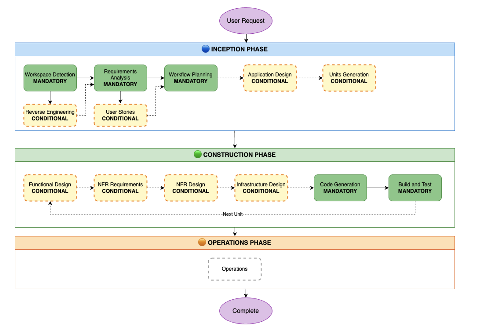

# AI-DLC Generated Files

**Current Stage**: CONSTRUCTION PHASE - Build and Test (Completed)

AI-DLC automatically generates documentation in `aidlc-docs/` as it progresses through the workflow. Below are the files created so far:

## Generated Files

| Name of File | Purpose |
|--------------|---------|
| `aidlc-state.md` | Tracks workflow progress and completed stages |
| `audit.md` | Complete audit log of all user inputs and AI responses |
| **Reverse Engineering Stage** | |
| `inception/reverse-engineering/business-overview.md` | Business context, transactions, and component descriptions |
| `inception/reverse-engineering/architecture.md` | System architecture, component interactions, and data flows |
| `inception/reverse-engineering/code-structure.md` | Project structure, design patterns, and file organization |
| `inception/reverse-engineering/api-documentation.md` | API endpoints, data models, and specifications |
| `inception/reverse-engineering/component-inventory.md` | Complete catalog of all packages and components |
| `inception/reverse-engineering/technology-stack.md` | Technology choices, versions, and tools used |
| `inception/reverse-engineering/dependencies.md` | Dependency analysis and version constraints |
| `inception/reverse-engineering/code-quality-assessment.md` | Quality metrics, test coverage, and technical debt |
| `inception/reverse-engineering/reverse-engineering-timestamp.md` | Analysis metadata and recommendations |
| **Requirements Analysis Stage** | |
| `inception/requirements/requirements.md` | Comprehensive requirements document with functional, non-functional, security, testing, deployment, and integration requirements |
| `inception/requirements/requirement-verification-questions.md` | Initial [x] number of requirement clarification questions with user answers |
| `inception/requirements/requirement-verification-questions-followup.md` | Follow-up questions based on user responses |
| **User Stories Stage** | |
| `inception/plans/user-stories-assessment.md` | Assessment of whether user stories add value for this project |
| `inception/plans/story-generation-plan.md` | Detailed plan for generating user stories with clarifying questions |
| `inception/user-stories/personas.md` | User personas representing different system users |
| `inception/user-stories/stories.md` | User stories with acceptance criteria organized by persona |
| **Workflow Planning Stage** | |
| `inception/plans/execution-plan.md` | Complete workflow execution plan showing which stages will be executed and at what depth |
| **Application Design Stage** | |
| `inception/plans/application-design-plan.md` | Plan for designing application components, methods, and business rules |
| `inception/application-design/application-design.md` | Complete application design document with overview and design decisions |
| `inception/application-design/components.md` | Detailed component definitions with responsibilities and interfaces |
| `inception/application-design/component-methods.md` | Method signatures and business logic for each component |
| `inception/application-design/services.md` | Service layer design with business rules and workflows |
| `inception/application-design/component-dependency.md` | Component dependency graph and interaction patterns |
| `inception/application-design/unit-of-work.md` | Units of work breakdown for implementation |
| `inception/application-design/unit-of-work-dependency.md` | Dependencies between units of work |
| `inception/application-design/unit-of-work-story-map.md` | Mapping of user stories to units of work |
| **Units Generation Stage** | |
| `inception/plans/unit-of-work-plan.md` | Plan for generating and organizing units of work |

## CONSTRUCTION PHASE

### Construction Planning

| Name of File | Purpose |
|--------------|---------|
| `construction/construction-plans-summary.md` | Summary of all construction plans and best practices |
| `construction/plans/construction-master-plan.md` | Master plan for construction phase execution |
| `construction/plans/foundation-infrastructure-functional-design-plan.md` | Functional design plan for foundation infrastructure unit |
| `construction/plans/foundation-infrastructure-code-generation-plan.md` | Code generation plan for foundation infrastructure unit |

### Build and Test Stage

| Name of File | Purpose |
|--------------|---------|
| `construction/build-and-test/build-and-test-summary.md` | Summary of all build and test instructions |
| `construction/build-and-test/build-instructions.md` | Complete build instructions for all units |
| `construction/build-and-test/unit-test-instructions.md` | Unit testing instructions and test cases |
| `construction/build-and-test/integration-test-instructions.md` | Integration testing instructions for component interactions |
| `construction/build-and-test/performance-test-instructions.md` | Performance testing instructions and benchmarks |

## OPERATIONS PHASE

**Status**: Operations is used to help with deployment of the application

It includes:
- Deployment planning and execution
- Monitoring and observability setup
- Incident response procedures
- Maintenance and support workflows
- Production readiness checklists

All build, test, and deployment activities are currently handled in the Construction phase.

## Three-Phase Workflow

AI-DLC follows a three-phase workflow:

1. **INCEPTION PHASE** (Planning & Design)
   - Workspace Detection
   - Reverse Engineering (brownfield only)
   - Requirements Analysis
   - User Stories (conditional)
   - Workflow Planning
   - Application Design (conditional)
   - Units Generation (conditional)

2. **CONSTRUCTION PHASE** (Implementation)
   - Functional Design (per unit)
   - NFR Requirements (per unit)
   - NFR Design (per unit)
   - Infrastructure Design (per unit)
   - Code Generation (per unit)
   - Build and Test

3. **OPERATIONS PHASE** (Deployment Assistance)
   - Operations is used to help with deployment of the application
